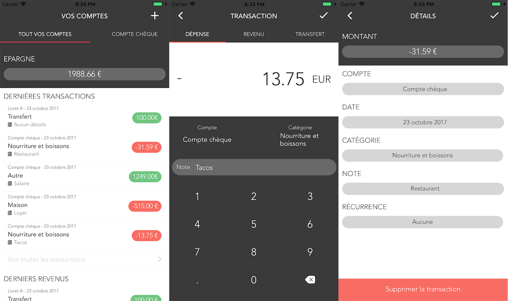

# Ecowin

Faites vos comptes simplement

## Mise en route

Ces instructions vous permettront d'obtenir une copie du projet opérationnel sur votre machine locale à des fins de développement et de test.

### Pré-requis

De quoi avez-vous besoin pour installer le logiciel et comment l'installer ?

```
npm
react-native
android studio
xcode (iOS)
```

### Installation

Voici comment lancer le projet sur votre ordinateur:

Cloner et se placer dans le répertoire Ecowin

Installation des dépendences
```
npm install
```

Lancement de l'application sur iOS

```
react-native run-ios
```

Lancement de l'application sur android

```
react-native run-android
```

## Captures d'écrans



## Construit avec

* [React-Native](https://facebook.github.io/react-native/)


## Auteurs

* **Romain Deguerville** - [RoromiDev](https://github.com/RoromiDev)
